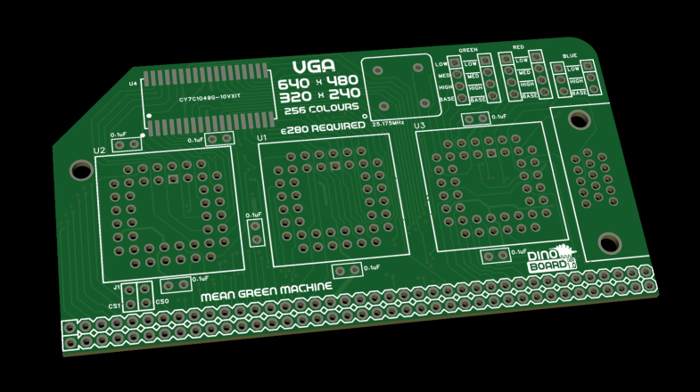

## VGA for RC

This repo contains designs and code for the RCBus kit - VGA for RC.

It still very much a work in progress

## References/Inspiration

* https://eater.net/vga
* https://www.glensstuff.com/vgavideocards/vgavideocards.htm

---

[SCHEMATIC](./vga-for-rc-schematic.pdf)
